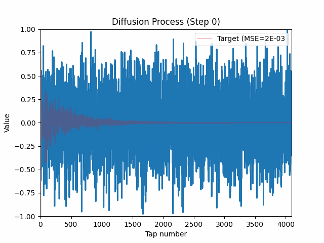

# RoomFuser

## Introduction

This project explores the usage of Denoising Diffusion Probabilistic Models (DDPMs) for the task
of acoustic Room Impulse Response (RIR) generation.

A RIR is defined for two points in a room, namely, a source and receiver (i.e., a microphone) position. It encodes
the three propagation effects which are applied to the raw or "dry" source signal, delay, attenuation and
reverberation. Examples of rooms with a high reverberation time are cathedrals and bathrooms, both of which
are good for singing. However, high reverberation also reduces speech inteligibility, which is a problem for
hard of hearing people.

RIRs are frequently generated using the [Image Source Method (ISM)](https://pubs.aip.org/asa/jasa/article/65/4/943/765693/Image-method-for-efficiently-simulating-small-room). However, this method is known to be computationally expensive.
The [FAST-RIR](https://github.com/anton-jeran/FAST-RIR) project proposes to train a Generative Adversarial Network (GAN) to 
learn RIRs, and shows that they are indeed faster than ISM.

As Diffusion Models have been shown to frequently [outclass GANs](https://openreview.net/pdf?id=AAWuCvzaVt) in terms of generation quality,
we decided to test them for this task. However, this project's current results were unable to beat FAST-RIR in terms of Mean Squared Error (MSE).
We are releasing it as it's still very cool to see the diffusion process in action, and hopefully somebody can find the secret sauce.

## Model details

We tested two different models, [DiffWave](https://arxiv.org/abs/2009.09761) and an [Unet1D](https://github.com/lucidrains/denoising-diffusion-pytorch).

### Conditioning

We condition the DiffWave model on a vector of size 10, namely, the room dimensions, source position, receiver position and reverberation time (RT60).
The conditioning is applied in a similar way as in the original DiffWave paper, by adding it as a bias after the convolutions.

In the UNet1D model, the conditioning is done by introducing a mean prior on the initial noise signal which is added during the forward process. The mean of the added noise is set as the value of a low-order RIR computed using the ISM. Computing the ISM on a low order is quite cheap, giving rise to a hybrid RIR generator.

### Feature extractors

* Time Domain
* Time Domain (Scaled)
* Frequency domain (i.e. Transfer Function)

## Usage

TODO
